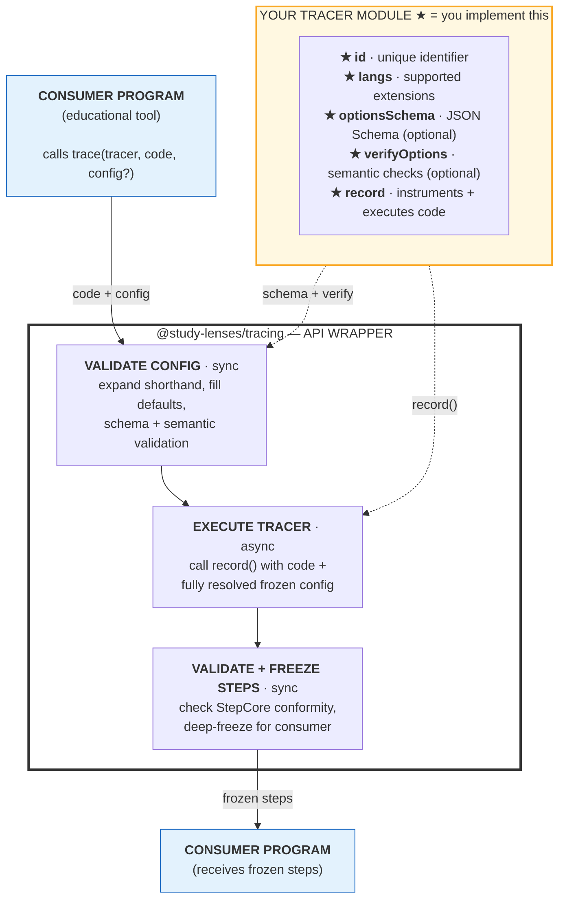

# @study-lenses/tracing

[](https://www.npmjs.com/package/@study-lenses/tracing)
[](https://github.com/study-lenses/tracing/actions/workflows/ci.yml)
[](./LICENSE)

> API wrapper infrastructure for `@study-lenses` tracer packages. Validates `TracerModule`
> objects and provides four pre-bound API wrappers: `trace`, `tracify`, `embody`, `embodify`.

## Pedagogical Purpose

**Neutral infrastructure.** This package makes no pedagogical decisions — those belong in
tracer implementations and the tools that consume them.

The same infrastructure pattern appears across technology stacks:

- **Git** provides version control infrastructure → **GitHub** builds collaboration workflows
- **Docker** provides container infrastructure → **Kubernetes** builds orchestration intelligence
- **SQL** provides data storage infrastructure → **ORMs** build application logic
- **`@study-lenses/tracing`** provides execution-tracing API infrastructure →
  **`@study-lenses/trace-*` packages** build language-specific tracing logic →
  **educational tools** build learning experiences on top

### Why Neutral?

Pedagogical approaches vary: constructivist vs. instructivist, individual vs. collaborative,
formative vs. summative, visual vs. textual. Staying neutral at this layer enables multiple
approaches to coexist. Domain experts (CS educators, learning scientists) can specialize
their tools without reinventing the tracing infrastructure.

### Config/Trace Symmetry

Config structure mirrors trace output structure. The limits you configure correspond to
the events you observe:

| Config (`meta.max.*`) | What it limits      | Trace output                |
| --------------------- | ------------------- | --------------------------- |
| `steps`               | Execution steps     | `step` field per `StepCore` |
| `iterations`          | Loop iterations     | Tracer-specific step fields |
| `callstack`           | Stack depth         | Tracer-specific step fields |
| `time`                | Execution time (ms) | `timestamps` option         |

### Only Log Learner-Visible Behavior

Tracer implementations should log what a professional debugger shows — explicit operations
that a learner would see and reason about. Implicit operations (e.g., implicit `toString`
coercions, internal VM bookkeeping) are not logged. This keeps traces meaningful.

---

## Who Is This For

**Primary — Tracer package developers** building `@study-lenses/trace-*` packages:

- CS Instructors building custom assessment tools for large classes
- EdTech Developers building debugging platforms for coding bootcamps
- Documentation Authors building interactive examples for libraries
- Research Tool Builders collecting data for CS education studies
- IDE Extension Developers building educational debugging visualizations

This package gives you the four standard API wrappers so you only write the `record()`
function. Everything else is handled.

**Secondary — Educational tool developers** consuming tracer packages:

- Building Study Lenses integrations, LMS plugins, or custom learning environments
- Consume tracer packages (which depend on this) rather than using this package directly

**Tertiary — CER researchers** using tracer packages for data collection or measurement.

---

## Install

```bash
npm install @study-lenses/tracing
```

---

## Quick Start

```typescript
// In a tracer package (typical use)
import tracing from '@study-lenses/tracing';
import tracerModule from './tracer-module.js';

// Validates tracerModule once upfront; returns 4 pre-bound wrappers
const { trace, tracify, embody, embodify } = tracing(tracerModule);

// trace: positional args, throws on error
const steps = await trace(code, config);

// embody: chainable, throws on error
const steps = await embody.code(code).config(config).steps;

// tracify: keyed args, returns { ok, steps } or { ok: false, error }
const result = await tracify({ code, config });
if (result.ok) console.log(result.steps);

// embodify: keyed + chainable, .trace() is async
const chain = await embodify({ code }).set({ config }).trace();
if (chain.ok) console.log(chain.steps);
```

---

## API — The 2x2 Matrix

|            | Simple    | Chainable  |
| ---------- | --------- | ---------- |
| **Throws** | `trace`   | `embody`   |
| **Safe**   | `tracify` | `embodify` |

**Throws** = errors propagate as exceptions. Use in scripts and REPLs.
**Safe** = errors returned as `{ ok: false, error }`. Use in production UIs.
**Simple** = all args at once. **Chainable** = build state across multiple calls.

Full API reference: run `npm run docs` locally, or see the [hosted API docs](https://study-lenses.github.io/tracing/).

---

## `TracerModule` Contract

Every tracer package exports one object matching this contract:

| Field           | Type                | Required | Purpose                                                          |
| --------------- | ------------------- | -------- | ---------------------------------------------------------------- |
| `id`            | `string`            | Yes      | Unique tracer ID, e.g. `'js:klve'` — used for cache invalidation |
| `langs`         | `readonly string[]` | Yes      | Supported file extensions; `[]` = universal tracer               |
| `record`        | `RecordFunction`    | Yes      | The tracing function                                             |
| `optionsSchema` | JSON Schema object  | No       | Tracer-specific options schema                                   |
| `verifyOptions` | `(opts) => void`    | No       | Cross-field semantic validation                                  |

```typescript
import type { TracerModule } from '@study-lenses/tracing';

const tracerModule: TracerModule = {
  id: 'js:klve',
  langs: Object.freeze(['js', 'mjs', 'cjs']),
  record: async (code, { meta, options }) => {
    // ... language-specific tracing logic
    return steps;
  },
  optionsSchema: {
    /* JSON Schema */
  },
  verifyOptions: (options) => {
    /* cross-field checks */
  },
};

export default tracerModule;
```

`langs: []` = universal tracer — accepts any language. The chainable APIs use `langs` to
decide whether to keep or clear code when switching tracers.

---

## What We Provide / What Your Tool Does

**We provide:**

- `TracerModule` validation (`TracerInvalidError` with aggregate violations)
- Config pipeline: shorthand expansion, default-filling, JSON Schema validation
- Four pre-bound API wrappers with immutable state, caching, and error handling
- All error classes for `instanceof` discrimination
- TypeScript types: `TracerModule`, `RecordFunction`, `StepCore`, `MetaConfig`, `ResolvedConfig`

**Your tracer does:**

- Language-specific parsing and execution tracing
- `options.schema.json` defining tracer-specific options
- Optional `verifyOptions` for cross-field constraints

**Your tool does:**

- Educational intelligence (what to show, when, how)
- Student-facing interfaces and visualizations
- Assessment logic and progress tracking
- Pedagogical sequencing and scaffolding

---

## Architecture

The wrapper pipeline has three phases: **VALIDATION** (synchronous) → **EXECUTION** (asynchronous) → **POST-PROCESSING** (synchronous). The diagram shows `trace` — the other wrappers (`tracify`, `embody`, `embodify`) follow the same pipeline with different access patterns and error handling.



Layer stack (bottom → top, each layer imports only from below):

```text
src/utils/       ← deep-clone, deep-freeze, deep-freeze-in-place, deep-merge, deep-equal
src/errors/      ← TracingError base + 9 specific error classes
src/configuring/ ← pure config pipeline (schema-agnostic, tracer-agnostic)
src/api/         ← trace, tracify, embody, embodify + validate-steps, validate-tracer-module
src/tracing.ts   ← tracing() sugar (validates TracerModule, returns pre-bound wrappers)
src/index.ts     ← entry point (re-exports everything public)
```

See [DEV.md](./DEV.md) for full architecture, conventions, and TDD workflow.
See [src/DOCS.md](./src/DOCS.md) for cross-cutting architectural decisions.

---

## Contributing

See [CONTRIBUTING.md](./CONTRIBUTING.md) and [DEV.md](./DEV.md).

## License

MIT © 2026 CodeSchool in a Box
